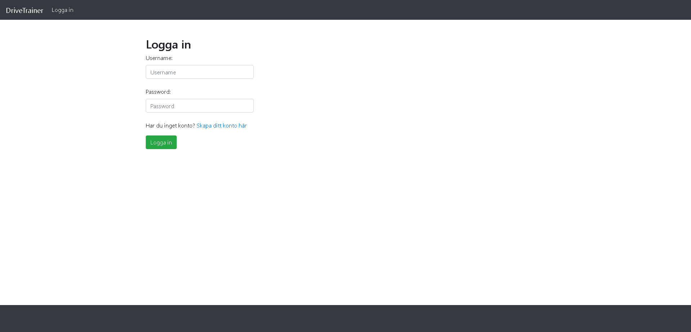

# DriveReady

**Deployed website: [Link to website](https://driveready.onrender.com/)**

## About

"DriveReady" is a website that allows user to learn about various roadsigns and traficRules. It has a login system, a quiz for the user to train. The main functionality of Adding,Updating,Deleting is purposed only for "Administrators/staff". Every person with the administrator privilage can do the "CRUD" operations
---

## UX

### Target Audience

This website is intended for people interested in learning how to drive a car. starting from Trafic Rules, Trafic Signs. This website is easy to use and navigate. 

### User Stories

---

## Future Development

#### Trafic Sign Quiz

### Add more content

---

## Technologies used
- ### Languages:
    
    + [Python 3.8.5](https://www.python.org/downloads/release/python-385/): the primary language used to develop the server-side of the website.
    + [JS](https://www.javascript.com/): the primary language used to develop interactive components of the website.
    + [HTML](https://developer.mozilla.org/en-US/docs/Web/HTML): the markup language used to create the website.
    + [CSS](https://developer.mozilla.org/en-US/docs/Web/css): the styling language used to style the website.

- ### Frameworks and libraries:

    + [Django](https://www.djangoproject.com/): python framework used to create all the logic.

- ### Databases:

    + [SQLite](https://www.sqlite.org/): was used as a development database.
    + [PostgreSQL](https://www.postgresql.org/): the database used to store all the data.

- ### Other tools:

    + [Git](https://git-scm.com/): the version control system used to manage the code.
    + [Pip3](https://pypi.org/project/pip/): the package manager used to install the dependencies.
    + [Gunicorn](https://gunicorn.org/): the web server used to run the website.
    + [Psycopg2](https://www.psycopg.org/): the database driver used to connect to the database.
    + [Django-allauth](https://django-allauth.readthedocs.io/en/latest/): the authentication library used to create the user accounts.
    + [GitHub](https://github.com/): used to host the website's source code.
    + [VSCode](https://code.visualstudio.com/): the IDE used to develop the website.
    + [Chrome DevTools](https://developer.chrome.com/docs/devtools/open/): was used to debug the website.
    + [W3C Validator](https://validator.w3.org/): was used to validate HTML5 code for the website.
    + [W3C CSS validator](https://jigsaw.w3.org/css-validator/): was used to validate CSS code for the website.
    + [PEP8](https://pep8.org/): was used to validate Python code for the website.
    + [Django-extensions](https://django-extensions.readthedocs.io/en/latest/) was used to create a Entity-Relationship Diagram.

---

## Features

---
## Design

### Color Scheme

### Wireframes

  

---

## Flowcharts
To understand some concepts, I created several flowchart diagrams.

1. Ability to preform CRUD (Create, Read , Update , Delete) functionalty for staff/admin users

[Flowchart](documentation/flowcharts/crud_functionality.png)

---

## Information Architecture

### Database

* During the earliest stages of the project, the database was created using SQLite.
* The database was then migrated to PostgreSQL.

### Entity-Relationship Diagram

### Data Modeling

---
## Testing

Please refer to the [TESTING.md](TESTING.md) file for all test-related documentation.

---

## Deployment and Payment setup

- The app was deployed to [Render](https://render.com/).
- The database was deployed to [ElephantSQL](https://www.elephantsql.com/).

- The app can be reached by the [link](https://wowder.onrender.com).

Please refer to the [DEPLOYMENT.md](DEPLOYMENT.md) file for all deployment.

---

## Credits

### Content and Images

---

## Acknowledgments
